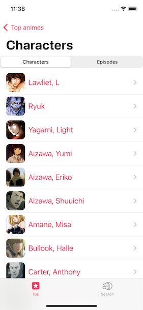
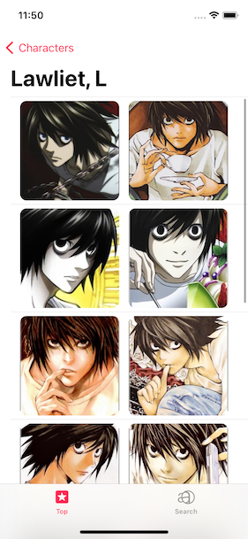
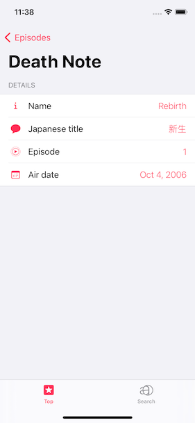

## Anime UI
Simple anime list app using SwiftUI / Combine with the MVVM pattern.

Data are fetched from an unofficial anime list API: https://jikan.docs.apiary.io/#introduction.

| Anime| Charactes  | Episodes |
| :-----: | :-: | :-: |
|  |  |  |
| :-----: | :-: | :-: |
|  |  |  |

Project structure:
- Models
- Features
  - List
  - Details
- Network

Next up:
- Search
- Dark mode support
- Pager mechanism refacoring